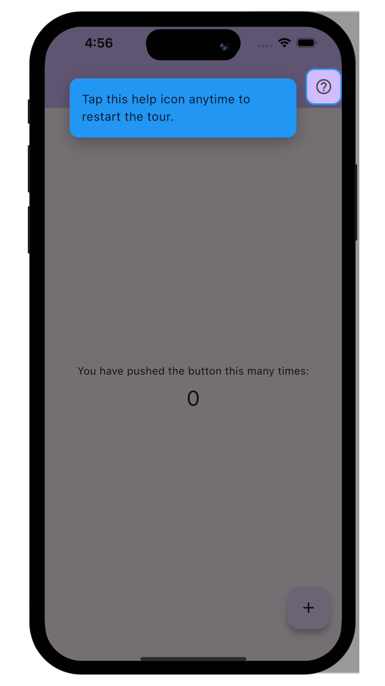
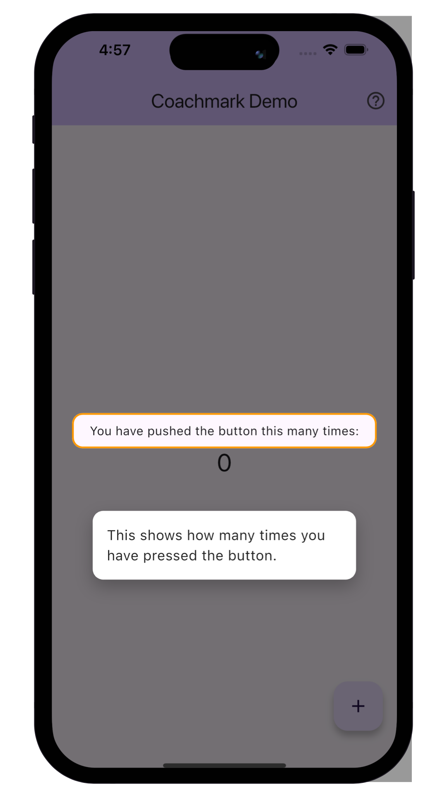
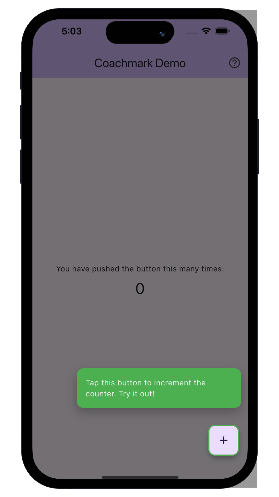

<div align="center">

# 🎯 Coachmark

[](https://pub.dev/packages/coachmark)
[](https://opensource.org/licenses/MIT)
[](https://flutter.dev)
[](https://dart.dev)

**Beautiful, customizable coach marks and onboarding overlays for Flutter**  
*Create stunning product tours with dynamic target highlighting*

[Installation](#-installation) •
[Quick Start](#-quick-start) •
[Features](#-features) •
[Examples](#-examples) •
[API Reference](#-api-reference)

</div>

---

## 📸 Screenshots

<p align="center">
  
  
  
</p>

---

## ✨ Features

- 🎯 **Dynamic Highlighting** - Wrap any widget to highlight it with a coach mark overlay
- 🎨 **Fully Customizable** - Control colors, sizes, borders, shadows, and positioning
- 📱 **Smart Positioning** - Automatically adjusts bubble position based on available screen space
- 🧭 **Position Control** - Auto-detect the best position or manually specify preferred placement
- 🌗 **Dimmed Overlay** - Creates focus by dimming the background with a cut-out hole
- 📏 **Highlight Padding** - Add extra space around highlighted targets
- 🔒 **Safe Area Support** - Optional control over safe area behavior
- 🧩 **Sequential Tours** - Easily create multi-step onboarding experiences
- 🪶 **Lightweight** - Zero external dependencies beyond Flutter SDK
- ⚡ **Simple API** - Widget-based, easy to integrate

---

## 📦 Installation

Add this to your package's `pubspec.yaml` file:

```yaml
dependencies:
  coachmark: ^0.1.0
```

Then run:

```bash
flutter pub get
```

> **Latest Version:** Check [pub.dev](https://pub.dev/packages/coachmark) for the most recent version.

---

## 🚀 Quick Start

### 1. Import the Package

```dart
import 'package:coachmark/coachmark.dart';
```

### 2. Wrap Your Widget

```dart
Coachmark(
  isVisible: true,
  config: CoachmarkConfig(
    description: 'Tap this button to perform an action!',
  ),
  onDismiss: () {
    // Handle dismiss
  },
  child: ElevatedButton(
    onPressed: () {},
    child: Text('My Button'),
  ),
)
```

That's it! Your first coachmark is ready. 🎉

---

## 📚 Examples

### Basic Usage

Show a simple coachmark on any widget:

```dart
import 'package:flutter/material.dart';
import 'package:coachmark/coachmark.dart';

class BasicExample extends StatefulWidget {
  @override
  State<BasicExample> createState() => _BasicExampleState();
}

class _BasicExampleState extends State<BasicExample> {
  bool _showCoachmark = false;

  @override
  Widget build(BuildContext context) {
    return Scaffold(
      appBar: AppBar(title: const Text('Coachmark Example')),
      body: Center(
        child: Column(
          mainAxisAlignment: MainAxisAlignment.center,
          children: [
            Coachmark(
              isVisible: _showCoachmark,
              config: const CoachmarkConfig(
                description: 'Tap this button to perform an action!',
                highlightBorderColor: Colors.blue,
              ),
              onDismiss: () => setState(() => _showCoachmark = false),
              child: ElevatedButton(
                onPressed: () {
                  // Your action
                },
                child: const Text('Action Button'),
              ),
            ),
            const SizedBox(height: 20),
            TextButton(
              onPressed: () => setState(() => _showCoachmark = true),
              child: const Text('Show Coachmark'),
            ),
          ],
        ),
      ),
    );
  }
}
```

### Custom Styling

Create a beautifully styled coachmark:

```dart
Coachmark(
  isVisible: true,
  config: CoachmarkConfig(
    description: 'This feature helps you accomplish your goals faster!',
    descriptionStyle: const TextStyle(
      fontSize: 16,
      color: Colors.white,
      fontWeight: FontWeight.w500,
    ),
    bubbleBackgroundColor: const Color(0xFF2C3E50),
    bubbleBorderColor: Colors.blueAccent,
    highlightBorderColor: Colors.greenAccent,
    highlightBorderWidth: 3.0,
    highlightCornerRadius: 16.0,
    highlightPadding: const EdgeInsets.all(8.0), // Add space around target
    bubbleCornerRadius: 12.0,
    bubblePadding: const EdgeInsets.all(20.0),
    bubbleMaxWidth: 320.0,
    overlayColor: const Color(0xAA000000),
    spacing: 16.0,
    preferredPosition: CoachmarkBubblePosition.bottom,
    bubbleShadow: [
      BoxShadow(
        color: Colors.black.withOpacity(0.3),
        blurRadius: 20,
        offset: const Offset(0, 10),
      ),
    ],
  ),
  onDismiss: () {
    // Handle dismiss
  },
  child: YourWidget(),
)
```

### Sequential Tour

Create a multi-step onboarding tour:

```dart
class OnboardingTour extends StatefulWidget {
  const OnboardingTour({super.key});

  @override
  State<OnboardingTour> createState() => _OnboardingTourState();
}

class _OnboardingTourState extends State<OnboardingTour> {
  bool _showStep1 = false;
  bool _showStep2 = false;
  bool _showStep3 = false;

  void _startTour() {
    setState(() => _showStep1 = true);
  }

  void _nextStep() {
    setState(() {
      if (_showStep1) {
        _showStep1 = false;
        _showStep2 = true;
      } else if (_showStep2) {
        _showStep2 = false;
        _showStep3 = true;
      } else {
        _showStep3 = false;
      }
    });
  }

  @override
  Widget build(BuildContext context) {
    return Scaffold(
      appBar: AppBar(
        title: const Text('Product Tour'),
        actions: [
          IconButton(
            icon: const Icon(Icons.help_outline),
            onPressed: _startTour,
          ),
        ],
      ),
      body: Column(
        children: [
          // Step 1: Highlight a menu item
          Coachmark(
            isVisible: _showStep1,
            config: const CoachmarkConfig(
              description: '👋 Welcome! Tap the help icon to restart this tour.',
              bubbleBackgroundColor: Colors.blue,
              descriptionStyle: TextStyle(color: Colors.white),
            ),
            onDismiss: _nextStep,
            child: ListTile(
              leading: const Icon(Icons.home),
              title: const Text('Home'),
              onTap: () {},
            ),
          ),
          
          // Step 2: Highlight settings
          Coachmark(
            isVisible: _showStep2,
            config: const CoachmarkConfig(
              description: '⚙️ Access your settings here.',
              highlightBorderColor: Colors.orange,
            ),
            onDismiss: _nextStep,
            child: ListTile(
              leading: const Icon(Icons.settings),
              title: const Text('Settings'),
              onTap: () {},
            ),
          ),
          
          // Step 3: Highlight profile
          Coachmark(
            isVisible: _showStep3,
            config: const CoachmarkConfig(
              description: '👤 View and edit your profile information.',
              bubbleBackgroundColor: Colors.green,
              descriptionStyle: TextStyle(color: Colors.white),
            ),
            onDismiss: _nextStep,
            child: ListTile(
              leading: const Icon(Icons.person),
              title: const Text('Profile'),
              onTap: () {},
            ),
          ),
        ],
      ),
    );
  }
}
```

### Highlight Padding Example

Add space around small tap targets:

```dart
Coachmark(
  isVisible: true,
  config: const CoachmarkConfig(
    description: 'Tap here to add a new item',
    highlightPadding: EdgeInsets.all(12.0), // Expands the highlight area
    highlightBorderColor: Colors.purple,
  ),
  onDismiss: () {},
  child: IconButton(
    icon: const Icon(Icons.add),
    onPressed: () {},
  ),
)
```

### Safe Area Control

Control whether the bubble respects safe areas:

```dart
Coachmark(
  isVisible: true,
  config: const CoachmarkConfig(
    description: 'This bubble can draw behind the status bar',
    drawOverSafeArea: true, // Allow bubble to extend into safe areas
  ),
  onDismiss: () {},
  child: YourWidget(),
)
```

---

## 📖 API Reference

### Coachmark Widget

```dart
Coachmark({
  required Widget child,
  required CoachmarkConfig config,
  bool isVisible = false,
  VoidCallback? onDismiss,
  GlobalKey? childKey,
})
```

| Property | Type | Required | Description |
|----------|------|----------|-------------|
| `child` | `Widget` | ✅ Yes | The widget to be highlighted |
| `config` | `CoachmarkConfig` | ✅ Yes | Configuration for appearance and behavior |
| `isVisible` | `bool` | No | Whether to show the coachmark (default: `false`) |
| `onDismiss` | `VoidCallback?` | No | Called when the overlay is dismissed |
| `childKey` | `GlobalKey?` | No | Optional key for the child widget |

### CoachmarkConfig

| Property | Type | Default | Description |
|----------|------|---------|-------------|
| `description` | `String` | Required | Text shown in the bubble |
| `descriptionStyle` | `TextStyle?` | `null` | Style for the description text |
| `bubbleBackgroundColor` | `Color` | `Colors.white` | Background color of the bubble |
| `bubbleBorderColor` | `Color?` | `null` | Border color of the bubble |
| `highlightBorderColor` | `Color` | `Colors.green` | Border color around the target |
| `highlightBorderWidth` | `double` | `2.0` | Border width around the target |
| `highlightCornerRadius` | `double` | `12.0` | Corner radius of the highlight |
| `highlightPadding` | `EdgeInsets` | `EdgeInsets.zero` | Padding around the highlighted target |
| `bubbleCornerRadius` | `double` | `12.0` | Corner radius of the bubble |
| `bubblePadding` | `EdgeInsets` | `EdgeInsets.all(16.0)` | Padding inside the bubble |
| `bubbleMaxWidth` | `double` | `300.0` | Maximum width of the bubble |
| `overlayColor` | `Color` | `Color(0x8C000000)` | Dim overlay background color |
| `bubbleShadow` | `List<BoxShadow>?` | `null` | Shadow for the bubble |
| `spacing` | `double` | `12.0` | Space between target and bubble |
| `preferredPosition` | `CoachmarkBubblePosition` | `auto` | Preferred bubble position |
| `drawOverSafeArea` | `bool` | `false` | Whether bubble can draw over safe areas |

### CoachmarkBubblePosition

```dart
enum CoachmarkBubblePosition {
  auto,    // Automatically choose the best position
  left,    // Place bubble to the left of the target
  right,   // Place bubble to the right of the target
  top,     // Place bubble above the target
  bottom,  // Place bubble below the target
}
```

---

## 💡 Best Practices

### ✅ Do's

- ✅ Use sequential coachmarks to guide users through complex flows
- ✅ Keep descriptions short and actionable (under 50 words)
- ✅ Test your coachmarks on different screen sizes
- ✅ Use `highlightPadding` to add breathing room around small targets
- ✅ Dismiss coachmarks on user interaction for better UX
- ✅ Use `GlobalKey` when highlighting widgets in complex layouts

### ❌ Don'ts

- ❌ Don't show too many coachmarks at once (3-5 max per tour)
- ❌ Don't block critical UI interactions with coachmarks
- ❌ Don't use tiny font sizes that are hard to read
- ❌ Don't forget to handle coachmark state properly
- ❌ Don't show the same coachmark repeatedly to returning users

---

## 🤝 Contributing

Contributions are welcome! Please feel free to submit a Pull Request.

1. Fork the repository
2. Create your feature branch (`git checkout -b feature/amazing-feature`)
3. Commit your changes (`git commit -m 'Add some amazing feature'`)
4. Push to the branch (`git push origin feature/amazing-feature`)
5. Open a Pull Request

---

## 📄 License

This project is licensed under the MIT License - see the [LICENSE](LICENSE) file for details.

---

## 🔗 Links

- **Repository:** [github.com/youseflabs-k/coachmark](https://github.com/youseflabs-k/coachmark)
- **Issues:** [github.com/youseflabs-k/coachmark/issues](https://github.com/youseflabs-k/coachmark/issues)
- **pub.dev:** [pub.dev/packages/coachmark](https://pub.dev/packages/coachmark)
- **Example App:** [example/](example/)

---

<div align="center">

**Made with ❤️ by [Ahmed Yousef](https://github.com/youseflabs-k)**

If you find this package helpful, please consider giving it a ⭐️!

</div>